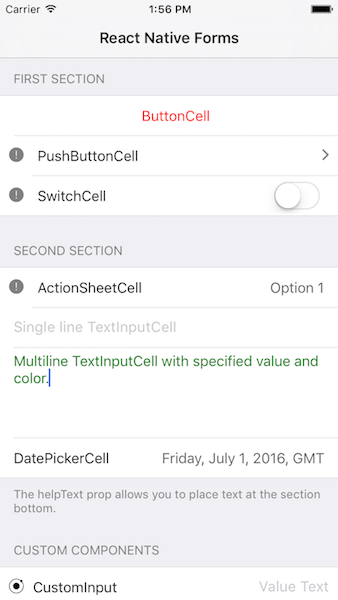
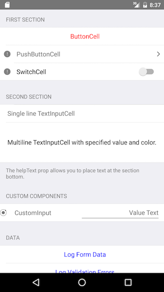

# React Native Forms #
[](https://badge.fury.io/js/react-native-forms)
[](https://travis-ci.org/michaelhelvey/react-native-forms)

### Project status

I wrote this library a number of months ago for a use-case at work, when React Native was still quite young, comparatively.  I open sourced it in the general spirit of sharing code that had been useful to me, but with the vicissitudes of life being what they are, I didn't have the opportunity to keep it up to date, and it's become a bit antiquated.  If you want to use it, go for it!  I'm still using it in production.  But I don't have time to update it or add features, though I will take PRs.  For similiar UI functionality within a much larger and better-maintained project, I'd recommend checking out [React Native Elements](https://react-native-training.github.io/react-native-elements/). Thanks for stopping by!

---

React Native Forms is a cross-platform library for creating native-looking forms using [React Native](https://github.com/facebook/react-native).

Some benefits of React Native Forms:

- Works for iOS and Android out of the box.
- Easily extensible, allowing for the creation of custom appearances and behaviors.
- Exposes functions for handling form data outside of the form components, for easy use in [Flux](https://github.com/facebook/flux) /[Redux](https://github.com/reactjs/redux) applications.
- Customizable form validation API.  Inject `validator` functions as props to all your form components, and get errors by simply calling `getValidationErrors` on your form to get a serialized copy of all your validation errors.
- Simple, declarative syntax - you don't have to write any styles at all to produce a form, if you don't want to (although all default styles are overridable)

```js
<Form ref={(form) => this.form = form}>
  <Section title={'SECTION'}>
    <PushButtonCell ref='push' title='Push me!'/>
    <TextInputCell
      ref='input'
      inputProps={{placeholder: 'Input here'}}
    />
  </Section>
</Form>
```
Then, you can get the the serialized data from your form by simply calling `this.form.getData();`

- Plus, a library of common form components available out of the box, for iOS and Android:

iOS             |  Android
:-------------------------:|:-------------------------:
  |  

<a name='Installation'></a>
## Installation ##
`npm install react-native-forms --save`

The package has no native dependencies.  In the example project, I use the excellent [react-native-vector-icons]('https://github.com/oblador/react-native-vector-icons') for icons in the example library and screenshots, but React Native Forms does not depend on it.

You can then require any component or function from the library:

`const { Form, Section, createValidator }  = require('react-native-forms');`

Or if you use ES6 syntax:

`import { Form, Section, createValidator } from 'react-native-forms';`

<a name='Documentation'></a>
## Documentation ##

### Form Validation

The top-level `Form` component exposes functions and props to handle data in the form.

- Functions called on the `Form` component.
  - [`getData()`](#getData)
  - [`getValidationErrors()`](#getValidationErrors)
- Function props passed to the `Form` component.
  - [`onChange([ref], [value])`](#onChange)
  - [`onPress([ref])`](#onPress)
  - [`onValidationError([ref], [message])`](#onValidationError)

If you are developing your own component for use with React Native Forms, note that an[`onChange([ref], [value])`](#onChange) and [`onPress([ref])`](#onPress) function is injected into each child component of a `Form`, and you will need to make sure you call `this.props.onChange(value)` or `this.props.onPress()` at the appropriate times.

Additionally, each child component has a `validator` prop, which you can use to pass a function to validate the component's value.  See [Form Validation](#FormValidation) below for more information.

### Method Reference

<a name='getData'></a>
#### getData() ####

Returns a *copy* of the form's data, expressed as an object, in the shape:

```js
{
  sectionRef: {
    firstChildRef: firstChildValue,
    secondChildRef: secondChildValue,
  },
};
```

<a name='getValidationErrors'></a>
#### getValidationErrors() ####

Returns a *copy* of the form's validation errors, expressed as an object of error objects in the shape:

```js
{
  sectionRef: {
    childRef: childValidationErrMessage,
  },
}
```

<a name='onChange'></a>
#### onChange([ref], [value]) ####

Where `ref` is the ref of the child component whose value has changed, and `value` is the new value of the child component.

Note: it is not recommended to perform validation as a result of this function.  Instead, inject a validator into the child component through the `validator` prop, and listen for validation errors at the the top-level `Form`'s [`getValidationErrors`](#getValidationErrors) or [`onValidationError`](#onValidationError) functions.

<a name='onPress'></a>
#### onPress([ref]) ####

Where `ref` is the ref of the child component responding to the touch event.  

This is called by each component that respond to touch events.  Examples from the library would include `PushButtonCell` or `ButtonCell`.

<a name='onValidationError'></a>
#### onValidationError([sectionRef], [sectionData]) ####

Where `sectionRef` is the ref of the child section component whose validation function has failed.  The error message is set as a value on whichever child of the section failed its `validator` prop.

You'll probably never need to use this function, since you probably only want to alert users of validation errors on submit.

<a name='FormValidation'></a>
### Form Validation

Each validation function takes a single argument, `value`, which contains the value of the component it's validating.  If validation fails, the function throws an error with a specified message.

The library exposes one generic function for creating validators: `createValidator`.

#### createValidator([validator], [options])

Returns a validator function, created with specified options.  You can pass either a validator from the library (such as `emailValidator`) or one of your own.

##### Arguments

- [`validator(value): boolean`] *Function*: This function is passed the value of the component the validator is passed to as a prop, and should return the boolean value of whether the component's value is valid.

- [`options`] *Object*: Customizes the behavior of the validator function.
  - [`errorMessage`] *String*: The message that the validator should fail with.

### Components

Out of the box, React Native Forms comes with
 - `ActionSheetCell` (ios only)
 - `ButtonCell`
 - `DatePickerCell` (ios only)
 - `PushButtonCell`
 - `SwitchCell`
 - `TextInputCell`

I've tried to make these components as consistent and customizable as possible, but PR's are highly welcome to improve their API, as well as to add more common form components, and improve documentation.  I'm also working to provide more components.

To learn how to use them, see their usage in the example project, as well as the available `propTypes` in each component's source.

#### Creating Custom Components

You can write your own components, and give them whatever styles or behaviors you want.  `Form` and `Section` components are agnostic as to the styles and behaviors of their children.

Remember that the parent `Section` will automatically inject `onPress` and `onChange` props into your component, and bind the child's `refs` to the function.  To make your component work with React Native Form's data API, simply call `this.props.onChange(value)` or `this.props.onPress()` at appropriate times.  For more information, see the example project.

<a name='FAQ'></a>
## FAQ ##

<a name='childKeyboardListenerError'/>
##### When I navigate to the form, I get an error: RCTUIManager.m Error frame is not a descendant of < RCTShadowView >

This error happens when you have multiple views listening for keyboard events.  This can happen, for example, when multiple scroll views inside a navigation stack are listening to keyboard events in order to scroll to a text input.

You can fix this by unmounting any components which are listening for keyboard events before presenting another.  React Native Forms depends on [react-native-keyboard-aware-scroll-view](https://github.com/APSL/react-native-keyboard-aware-scroll-view), which listens for keyboard events if you've enabled the `keyboardAware` prop on your top-level `Form` component.

I'd like to fix this and allow for keyboard aware child forms.  This seems to be possible.  (For example, see [this discussion](https://github.com/facebook/react-native/pull/7876) in react-native).  PR's are welcome.

<a name='Contributing'></a>
## Contributing ##

PR's are *very* welcome!  This is a very young library, and probably has a wealth of bugs and optimizations to fix and improve on.  I have just a couple requests:

- Please use the linter included with the package for code style.  I follow [Airbnb](https://github.com/airbnb/javascript), with a few modifications.
- Update the documentation and example project if necessary/applicable.

Thank you!

<a name='License'></a>
## License ##
 MIT
